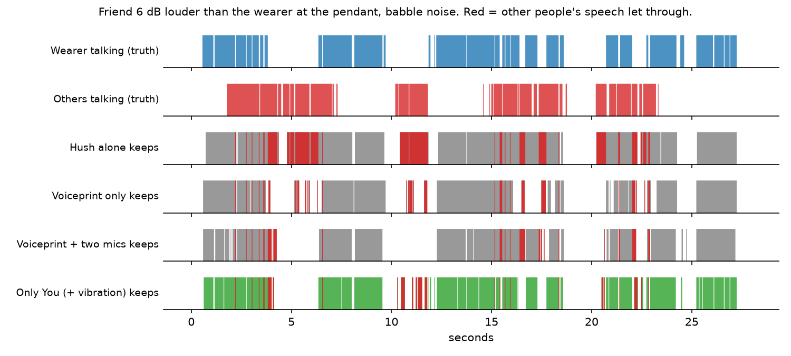
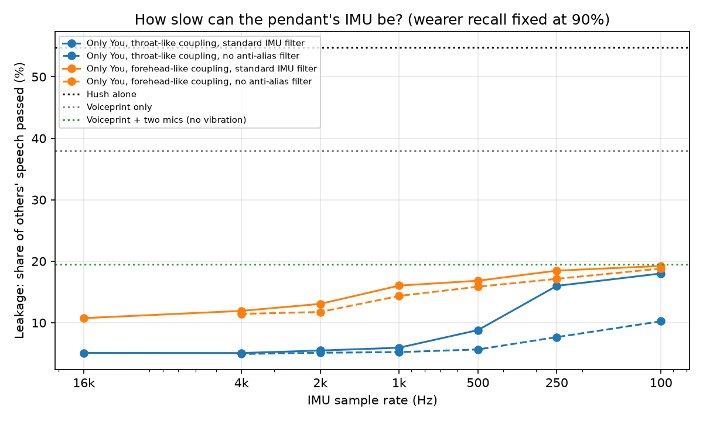

# Only You

**A pendant should hear only its wearer.** Only You is a CPU-only pipeline that decides, every 32 ms,
whether the person wearing an AI pendant is the one speaking, drops everyone else before transcription,
and turns what is left into a journal where every line cites the moment it came from.

Built as a working answer to two problems an always-listening AI necklace (like [Nirva](https://www.nirva.life/))
has to solve:

1. **Listen only to the wearer.** Speech-enhancement models such as Hush, Krisp or ai-coustics keep the
   *loudest* voice. On a necklace the loudest voice is often a friend across the table or the TV.
2. **Grounded memory.** Journals and insights must come from what the wearer actually said.

## Results

**Hush alone lets 55% of other people's speech through. Only You lets 6% through**, at the same 90%
of the wearer's speech kept. With a worst-case, poorly coupled vibration sensor it is 16%.



40 test scenes, speakers never seen in training, IMU at 1 kHz with a standard anti-alias filter:

| System | Wearer speech kept | Others' speech leaked (95% CI) | Leaked when friend is louder than wearer | False triggers on noise |
|---|---|---|---|---|
| No filter (any speech) | 93.9% | **69.9%** (63-77%) | 78.9% | 18.1% |
| Hush alone | 91.5% | **54.8%** (48-63%) | 66.4% | 13.4% |
| Voiceprint only | 90.2% | **38.0%** (33-44%) | 43.8% | 15.9% |
| Two mics only | 92.5% | **23.8%** (19-29%) | 27.8% | 12.0% |
| Voiceprint + two mics (no vibration) | 91.9% | **19.5%** (16-24%) | 21.3% | 9.3% |
| Vibration only, throat-like coupling | 89.5% | **8.3%** (7-10%) | 12.8% | 4.5% |
| **Only You, throat-like coupling** | 90.7% | **5.9%** (5-8%) | 7.2% | 3.3% |
| Vibration only, forehead-like coupling | 91.2% | **44.6%** (40-50%) | 54.1% | 13.0% |
| **Only You, forehead-like coupling** | 91.1% | **16.0%** (13-19%) | 16.0% | 8.0% |

Listen to the scene above: [`results/demo/`](results/demo/) has the raw pendant mic, Hush alone,
voiceprint only and Only You.

### How slow can the IMU be?



- **1 kHz is enough.** With good body coupling, leakage stays at 5-6% from 16 kHz down to 1 kHz.
- **Below 500 Hz, a standard IMU filter throws the voice away.** Speech vibration (roughly 85-255 Hz
  pitch and its harmonics) sits above the Nyquist limit, so the anti-alias filter removes it: leakage
  climbs to 16-18%, close to having no vibration at all (19.5%).
- **Turning that filter off keeps most of the benefit at low rates.** Without it, voice energy folds
  into the low band instead of being removed: 7.7% leakage at 250 Hz and 10% at 100 Hz. Many MEMS
  IMUs let firmware bypass the digital low-pass filter.
- **Coupling matters more than rate.** A poorly coupled sensor still helps (19.5% to 16% at 1 kHz,
  11% at 16 kHz), but how firmly the pendant rests on the chest decides most of the gain.

<!-- WORDS -->

## The idea: feel the voice, don't just hear it

[antimattr](https://www.antimattr.one/) (YC F26) isolates the wearer in its earbuds with **bone conduction**:
the wearer's voice arrives as vibration through the body, which nobody else's voice can produce.
A pendant resting on the sternum already carries a sensor that can feel that vibration: its **IMU**.

Only You fuses three cues a pendant already has:

| Cue | Why it separates the wearer | Source in this repo |
|---|---|---|
| **Chest vibration (IMU)** | Only the wearer's own speech shakes the pendant | Vibravox throat-mic and forehead-accelerometer recordings, re-sampled to IMU rates |
| **Two-mic proximity** | Mouth is ~15 cm away: louder at the top mic, fixed arrival-time difference, mostly direct sound | Two mics 2.5 cm apart, rendered with `pyroomacoustics` |
| **Voiceprint** | Who is speaking | SpeechBrain ECAPA-TDNN (pretrained, CPU) |

then cleans what passes with **Hush** (weya-ai's open-source speech enhancer) and hands only the
wearer's speech to transcription and memory.

```
2 mics ──► Hush ──► voice activity ─┐
   │                voiceprint ─────┤
   └──► level / arrival time / ─────┼──► gate (gradient-boosted trees, causal) ──► wearer-only audio
        coherence                   │                                                 │
IMU ──► vibration energy / ─────────┘                                     Whisper (CPU) ▼
        body-vs-air ratio                                       moments ──► journal with [m3] citations
                                                                                 └─► grounding check
```

## How it is tested

No hardware is needed. Everything is simulated from public recordings, with speakers that never
appear in training:

- **Scenes**: 60 training and 40 test "pendant days", each 10-28 s. A wearer talks; a friend talks at
  0.8-3 m (from 6 dB *louder* than the wearer to 12 dB quieter at the pendant); half the scenes add a TV;
  traffic or crowd babble at 0-15 dB SNR; rooms with 0.2-0.7 s reverberation.
- **Realism knobs**: the pendant's position relative to the mouth varies per scene, the two mics have
  up to ±2 dB gain mismatch and their own noise floor, and half the scenes include walking motion on the IMU.
- **Vibration leakage**: outside sound also reaches body sensors. Leakage is scaled from each sensor's
  measured signal-to-external-noise ratio in the Vibravox paper: throat mic 25.6 dB (well-coupled,
  best case) and forehead accelerometer -3.5 dB (poorly coupled, worst case). A chest IMU should sit
  between the two, so results are reported for both.
- **Metric**: every system is calibrated on training scenes to keep **90% of the wearer's speech**, then
  measured on test scenes. *Leakage* is the share of frames where only other people are talking that
  still get through.

## Run it

```bash
./scripts/setup.sh                      # CPU-only: Python 3.11 venv, Hush source, deps
source .venv/bin/activate
python scripts/fetch_vibravox.py        # ~4 GB download, keeps ~150 MB at 16 kHz
python scripts/prepare.py               # build scenes + cache features (~1 h on a laptop)
python scripts/evaluate.py              # leakage table + IMU sample-rate sweep
python scripts/eval_words.py            # word-level check with Whisper
python -m pytest
```

### Live demo (laptop mic or earbuds)

A laptop has one mic and no vibration sensor, so the live gate uses voiceprint + Hush only.

```bash
python scripts/live_demo.py devices
python scripts/live_demo.py enroll --mic "Digital Microphone"   # read the prompt for 25 s
python scripts/live_demo.py live   --mic "Digital Microphone"   # Ctrl+C: saves audio + journal
python scripts/live_demo.py process street.wav                  # any recording
```

### Real-world earbud comparison

Compare against the OnePlus Nord Buds 3's built-in call noise cancellation: you read a script while
the laptop speaker plays another voice with known transcripts.

```bash
python scripts/live_demo.py enroll --mic "Digital Microphone" --buds "Nord Buds 3-95"
python scripts/nordbuds_bench.py record
python scripts/nordbuds_bench.py score   # -> results/nordbuds_benchmark.md
```

## Limits

- Vibravox is French speech with sensors on the throat and forehead, not the chest. It stands in for a
  pendant IMU; detecting vibration does not depend on language, but absolute numbers will move on real
  hardware. That is why both a best-case and a worst-case coupling are reported.
- The two-mic cues are simulated. Real pendants add clothing rustle and body reflections.
- IMU emulation (sample rate, optional missing anti-alias filter, noise floor, walking) is a model,
  not a measurement of any specific part.
- The journal layer is deliberately thin: it shows the contract (wearer-only input, every line cited,
  automatic grounding check), not a finished product.

## Layout

```
onlyyou/      audio, enhance (Hush), vad, voiceprint, vibration, proximity, scenes, gate, pipeline,
              transcribe, memory
scripts/      fetch_vibravox, prepare, evaluate, eval_words, live_demo, nordbuds_bench
results/      tables, plots, transcripts
tests/        unit tests
```

Credits: [Hush](https://github.com/pulp-vision/Hush) (Apache 2.0), [Vibravox](https://huggingface.co/datasets/Cnam-LMSSC/vibravox)
(CC BY 4.0), [SpeechBrain ECAPA](https://huggingface.co/speechbrain/spkrec-ecapa-voxceleb),
[Silero VAD](https://github.com/snakers4/silero-vad), [faster-whisper](https://github.com/SYSTRAN/faster-whisper),
[pyroomacoustics](https://github.com/LCAV/pyroomacoustics).
